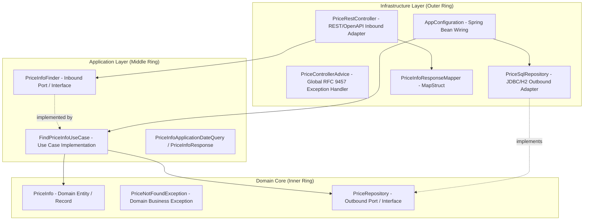

# AGENTS.md

Development, architecture, and conventions guide for AI agents and human developers working in the `price-service` repository.

---

## 1. Project Overview

`price-service` is a microservice developed in Java with Spring Boot designed to query the applicable final price of a product belonging to a specific brand for a given date and time.

### Key Business Rules
- If multiple price tiers (`price_list`) overlap for a given product, brand, and date range, the rate with the **highest priority** (`priority desc`) must be applied.
- In case of a tie in priority, the record with the most recent update timestamp (`last_update_by desc`) wins.
- If no record matches the query criteria, a specific domain business exception (`PriceNotFoundException`) must be thrown, producing an HTTP `404 Not Found` response compliant with RFC 9457 (`ProblemDetail`).

---

## 2. Project Architecture (Onion / Hexagonal Architecture)

The project strictly follows the **Onion Architecture** (Hexagonal / Clean Architecture) pattern. The foundational rule is the **Dependency Inversion Principle**: inner layers have no knowledge of outer layers, and source code dependencies point strictly inward.



### Package and Directory Structure

```
price-service/
├── build.gradle                               # Gradle build configuration, dependencies, and plugins
├── settings.gradle                            # Gradle project settings
├── docker/
│   └── Dockerfile                             # Multi-stage Docker container build
├── src/
│   ├── main/
│   │   ├── java/io/github/agomezlucena/priceservice/
│   │   │   ├── domain/                        # DOMAIN CORE (Pure Java, 0 external dependencies)
│   │   │   │   ├── PriceInfo.java             # Immutable domain entity record
│   │   │   │   ├── PriceRepository.java       # Outbound Port interface
│   │   │   │   └── PriceNotFoundException.java# Domain business exception
│   │   │   ├── application/                   # USE CASES AND INBOUND PORTS
│   │   │   │   ├── PriceInfoFinder.java       # Inbound Port interface
│   │   │   │   ├── FindPriceInfoUseCase.java  # Use case orchestrator
│   │   │   │   ├── PriceInfoApplicationDateQuery.java # Query DTO
│   │   │   │   └── PriceInfoResponse.java     # Application layer response DTO
│   │   │   ├── infrastructure/                # ADAPTERS, CONFIGURATION, AND FRAMEWORK
│   │   │   │   ├── AppConfiguration.java      # Spring dependency injection and bean wiring
│   │   │   │   ├── PriceRestController.java   # REST Controller (OpenAPI Inbound Adapter)
│   │   │   │   ├── PriceControllerAdvice.java # Global exception handler (RFC 9457)
│   │   │   │   ├── PriceInfoResponseMapper.java # MapStruct mapper (App DTO -> Web DTO)
│   │   │   │   └── PriceSqlRepository.java    # Persistence adapter using Spring JdbcClient
│   │   │   └── PriceServiceApplication.java   # Spring Boot application entry point
│   │   └── resources/
│   │       ├── application.properties         # Application configuration (Actuator, Metrics)
│   │       ├── openapi.yaml                   # OpenAPI 3.1.0 Contract (Single Source of Truth)
│   │       └── db/changelog/                  # Liquibase database migrations
│   │           ├── db.changelog-master.yaml   # Master changelog
│   │           └── prices/prices.changelog.yaml # Price tables, indexes, and initial data
│   └── test/
│       └── java/io/github/agomezlucena/priceservice/
│           ├── PriceServiceApplicationTests.java # Spring Boot context smoke test
│           ├── application/
│           │   └── FindPriceInfoUseCaseTest.java # Use case unit tests (with Mockito)
│           └── infrastructure/
│               ├── PriceInfoResponseMapperTest.java    # MapStruct mapper unit tests
│               ├── PriceSqlRepositoryItTest.java       # JDBC integration tests with Liquibase + H2
│               ├── PriceControllerAdviceItTest.java    # Error handler integration tests
│               └── PricesRestControllerItTest.java    # End-to-End MockMvc integration tests
```

---

## 3. Technology Stack

| Component | Technology | Version / Details |
| :--- | :--- | :--- |
| **Language** | Java | 25 |
| **Framework** | Spring Boot | 4.1.1 (WebMVC, Actuator, AOP) |
| **API Generation** | OpenAPI Generator | 7.10.0 (`contract-first`, OpenAPI 3.1.0 spec) |
| **Database** | H2 (in-memory) | Managed via Spring `JdbcClient` |
| **DB Migrations** | Liquibase | YAML format changelogs |
| **Object Mapping** | MapStruct | 1.6.3 |
| **Metrics & Monitoring** | Micrometer & Prometheus | `@Timed` on controller and repository |
| **Testing** | JUnit 5 + MockMvc + AssertJ | Unit and integration testing |
| **Build Tool** | Gradle | Wrapper included (`./gradlew`) |

---

## 4. Invariants and Development Rules for Agents

When making any code modification, agents must strictly follow these directives:

### 1. Domain Layer Purity (`domain`)
- **Strictly forbidden** to add Spring, Jakarta, Jackson, MapStruct, or any third-party framework annotations/dependencies in `domain/`.
- The domain must consist only of standard Java (records, interfaces, exceptions).

### 2. Contract-First API Approach
- The REST API contract is defined in `src/main/resources/openapi.yaml`.
- Controller interfaces (`PriceQueryApi`) and API models (`PriceResponse`) are auto-generated at build time under `build/generated`.
- **Never** manually modify files inside `build/generated`.
- To modify an endpoint or API model:
  1. Update `src/main/resources/openapi.yaml`.
  2. Run `./gradlew openApiGenerate` (or `./gradlew compileJava`).
  3. Adapt `PriceRestController` and `PriceInfoResponseMapper` as needed.

### 3. Inversion of Control and Bean Configuration
- Use cases in `application/` (`FindPriceInfoUseCase`) must **not** have `@Service` or `@Component` annotations.
- They must be explicitly registered as a `@Bean` in `AppConfiguration.java`.

### 4. Persistence and SQL Queries
- Persistence is handled via `JdbcClient` in `PriceSqlRepository`.
- The price selection logic by date range and priority ordering must reside in the SQL query ordered by `priority desc, last_update_by desc limit 1`.
- Any schema or initial data changes must be performed through Liquibase (`src/main/resources/db/changelog/`).

### 5. Error Handling
- Domain exceptions or validation failures are handled centrally in `PriceControllerAdvice`.
- All error responses must comply with the **RFC 9457 Problem Details** standard (`ProblemDetail`).

### 6. Immutability and Typing
- Use Java `record`s for immutable domain entities and DTOs (`PriceInfo`, `PriceInfoResponse`, `PriceInfoApplicationDateQuery`).

---

## 5. Build, Run, and Test Commands

Commands should be executed from the project root using the Gradle wrapper:

### Compilation and Code Generation
```bash
# Generate OpenAPI interfaces and models
./gradlew openApiGenerate

# Compile main source code (triggers openApiGenerate automatically)
./gradlew compileJava

# Compile all source code including tests
./gradlew testClasses
```

### Test Execution
```bash
# Run the entire test suite
./gradlew test

# Run a specific test class
./gradlew test --tests "io.github.agomezlucena.priceservice.infrastructure.PricesRestControllerItTest"

# Run a specific test method
./gradlew test --tests "io.github.agomezlucena.priceservice.infrastructure.PricesRestControllerItTest.shouldReturnTheExpectedPriceForGivenApplicationDate"
```

### Running the Application
```bash
# Start the application locally (port 8080)
./gradlew bootRun
```

### Docker
```bash
# Build the Docker image using Gradle task
./gradlew buildDockerImage

# Or directly with Docker CLI
docker build -t price-service:latest -f docker/Dockerfile .
```

---

## 6. Testing Strategy and Conventions

The project maintains a clear separation between unit and integration tests:

1. **Unit Tests (`*Test.java`)**:
   - `FindPriceInfoUseCaseTest`: Verifies use case business logic isolating repository dependencies with `Mockito`.
   - `PriceInfoResponseMapperTest`: Validates correct property mapping between application DTOs and OpenAPI-generated models.

2. **Integration Tests (`*ItTest.java`)**:
   - `PriceSqlRepositoryItTest`: Tests the JDBC repository against the in-memory H2 database populated by actual Liquibase migrations.
   - `PriceControllerAdviceItTest`: Verifies HTTP responses for validation failures, invalid arguments, and unhandled exceptions.
   - `PricesRestControllerItTest`: Full end-to-end HTTP integration tests using `@SpringBootTest` and `MockMvc`, covering the 5 core business scenarios via `@ParameterizedTest` / `@CsvSource` as well as error conditions (404 and 400).

---

## 7. Agent Checklist for Code Changes

Before completing any task in this repository, verify:
- [ ] Does the code compile cleanly with `./gradlew compileJava`?
- [ ] Do all tests pass successfully with `./gradlew test`?
- [ ] Is the domain layer pure, without external framework dependencies?
- [ ] If the API was modified, was `openapi.yaml` updated and classes regenerated?
- [ ] If the database schema/data was changed, was a new `changeSet` added to Liquibase?
- [ ] Have unit or integration tests been added/updated to cover new functionality or edge cases?
