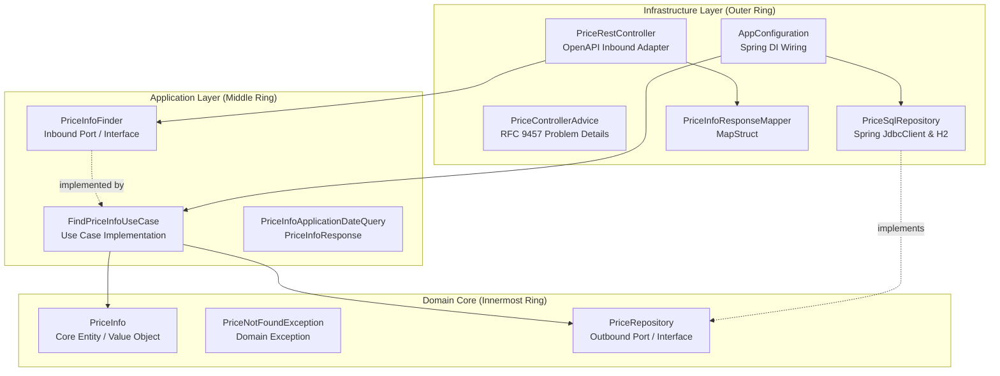

# Price Service

A Spring Boot microservice designed to provide product pricing information based on brand, product identifier, and application timestamp. The service enforces strict separation of concerns, high testability, and framework independence through **Onion Architecture** (Hexagonal / Clean Architecture style).

---

## 🏛️ Architecture Overview: Onion Architecture

The project strictly follows the principles of **Onion Architecture**. The primary tenet is the **Dependency Inversion Principle** and the **Dependency Rule**: *inner rings define domain interfaces and core business logic without knowing anything about outer rings, and source code dependencies only point inwards*.



### Architectural Layers & Package Structure

```
src/main/java/io/github/agomezlucena/priceservice/
├── domain/                  # Core Business Domain (Zero external dependencies)
│   ├── PriceInfo.java       # Domain Entity / Record
│   ├── PriceRepository.java # Outbound Port (Repository Interface)
│   └── PriceNotFoundException.java # Domain-specific business exception
│
├── application/             # Application Use Cases & Inbound Ports
│   ├── PriceInfoFinder.java # Inbound Port (Use Case Interface)
│   ├── FindPriceInfoUseCase.java # Use Case Orchestrator implementation
│   ├── PriceInfoApplicationDateQuery.java # Query DTO
│   └── PriceInfoResponse.java # Application Response DTO
│
├── infrastructure/          # Adapters, Frameworks & Config (Outer Ring)
│   ├── AppConfiguration.java # Spring Bean Configuration
│   ├── PriceRestController.java # REST Controller (Inbound HTTP Adapter)
│   ├── PriceControllerAdvice.java # Global Exception Handler (RFC 9457)
│   ├── PriceInfoResponseMapper.java # MapStruct Mapper (Application DTO -> Web DTO)
│   └── PriceSqlRepository.java # Database Adapter (Outbound JDBC Adapter)
│
└── PriceServiceApplication.java # Spring Boot Entrypoint
```

---

### Layer Responsibilities

#### 1. Domain Layer (`domain`)
- **Innermost core** containing business concepts, entities, value objects, and contracts.
- **Pure Java**: Has zero dependencies on external frameworks, Spring Boot, or persistence libraries.
- Defines `PriceRepository` (outbound port) specifying *what* data operations the domain needs, without dictating *how* they are implemented.

#### 2. Application Layer (`application`)
- Contains application-specific business workflows and use cases (`FindPriceInfoUseCase`).
- Defines inbound ports (`PriceInfoFinder`) and request/response DTOs (`PriceInfoApplicationDateQuery`, `PriceInfoResponse`).
- Coordinates domain entities and ports to satisfy application requirements while keeping domain logic clean and decoupled.

#### 3. Infrastructure Layer (`infrastructure`)
- Adapts external mechanisms (HTTP requests, databases, serialization, framework configuration) to the application and domain layers.
- **Inbound Adapter**: `PriceRestController` implements the generated OpenAPI contract interface (`PriceQueryApi`) and delegates execution to `PriceInfoFinder`.
- **Outbound Adapter**: `PriceSqlRepository` implements `PriceRepository` using Spring's `JdbcClient` to query the relational database.
- **Error Handling**: `PriceControllerAdvice` provides centralized exception handling, translating domain exceptions (`PriceNotFoundException`), validation/binding errors, and unexpected server failures into standard RFC 9457 `ProblemDetail` HTTP responses.
- **Inversion of Control**: `AppConfiguration` wires application use cases with infrastructure adapters using Spring dependency injection.

---

## 🛠️ Technology Stack

- **Java**: 25
- **Framework**: Spring Boot 4.1.1 (Spring WebMVC, Spring Actuator, AOP)
- **API Specification & Code Generation**: OpenAPI 3.1.0 with OpenAPI Generator Gradle Plugin (Contract-First approach)
- **Database & Persistence**: H2 Database with Spring `JdbcClient`
- **Database Migration**: Liquibase
- **Mapping**: MapStruct 1.6.3
- **Observability & Metrics**: Micrometer & Prometheus (`@Timed` metric tracking)
- **Testing**: JUnit 5, Spring Boot Test, MockMvc, Liquibase Test
- **Containerization**: Docker multi-stage build

---

## 🚀 Getting Started

### Prerequisites
- **JDK 25** installed and configured in `JAVA_HOME`.
- **Docker** (optional, for containerized deployment).

### Build and Test

Compile the project and run all unit and integration tests:

```bash
# On Linux / macOS
./gradlew clean test

# On Windows (PowerShell / Command Prompt)
.\gradlew.bat clean test
```

The test suite covers:
- **Unit Tests**: Domain and application use cases (`FindPriceInfoUseCaseTest`), MapStruct mappers (`PriceInfoResponseMapperTest`), and centralized error handling (`PriceControllerAdviceTest`).
- **Integration Tests**: Full Spring MVC test suite (`PricesRestControllerItTest`) validating the 5 standard price rate scenarios, promotional priority resolution, and negative cases (malformed dates, missing headers, missing parameters).

### Run Locally

Start the Spring Boot application:

```bash
# On Linux / macOS
./gradlew bootRun

# On Windows
.\gradlew.bat bootRun
```

The service will start on port `8080`.

---

## 📖 API & Query Model

The project follows a **Contract-First** approach using OpenAPI 3.1. The API contract is defined in `src/main/resources/openapi.yaml`.

- **Swagger UI**: [http://localhost:8080/swagger-ui.html](http://localhost:8080/swagger-ui.html)
- **OpenAPI JSON Spec**: [http://localhost:8080/v3/api-docs](http://localhost:8080/v3/api-docs)

### Query Model (Request)

To evaluate and retrieve the applicable price, a query requires three key parameters:

| Field | Location | Type | Required | Description |
|---|---|---|---|---|
| `X-Brand-Id` | Header | Integer | Yes | Brand identifier |
| `productId` | Path | Integer | Yes | Product identifier |
| `applicationDate` | Query | ISO-8601 DateTime | Yes | Target timestamp for which the price is evaluated (e.g., `2020-06-14T10:00:00Z`) |

### Response Model

When a valid price is found, the service responds with a `200 OK` containing the following attributes:

| Field | Type | Description |
|---|---|---|
| `brand_id` | Integer | Brand identifier |
| `product_id` | Integer | Product identifier |
| `charge_id` | Integer | Applicable tariff / rate tier identifier |
| `price` | Decimal / Number | Final sale price |
| `currency` | String | ISO 4217 standard 3-letter currency code (e.g., `EUR`) |
| `price_start_at` | ISO-8601 DateTime | Start timestamp of the price validity period |
| `price_ends_at` | ISO-8601 DateTime | End timestamp of the price validity period |

### Price Selection & Priority Rules

When evaluating a price query:

1. **Filtering**: The service searches for price records matching the specified brand and product whose validity period encompasses the requested `applicationDate` (`price_start_at` &le; `applicationDate` &le; `price_ends_at`).
2. **Priority Resolution**: If multiple price records match the criteria, the record with the **highest priority** is selected. In the event of a tie (identical highest priority), the most recently updated record is chosen.

### Query Price Endpoint

```http
GET /api/v1/products/{productId}/prices?applicationDate={applicationDate}
```

#### Example Request
```bash
curl -X GET "http://localhost:8080/api/v1/products/35455/prices?applicationDate=2020-06-14T16:00:00Z" \
     -H "X-Brand-Id: 1" \
     -H "Accept: application/json"
```

#### Example Response (`200 OK`)
```json
{
  "brand_id": 1,
  "product_id": 35455,
  "charge_id": 2,
  "price": 25.45,
  "currency": "EUR",
  "price_start_at": "2020-06-14T15:00:00Z",
  "price_ends_at": "2020-06-14T18:30:00Z"
}
```

#### Error Responses (`application/problem+json` - RFC 9457)

All error payloads strictly follow the RFC 9457 Problem Details specification:

##### 400 Bad Request (Validation & Parameter Errors)

- **Missing Required Header (`X-Brand-Id`):**
```json
{
  "title": "Bad Request",
  "status": 400,
  "detail": "Required header 'X-Brand-Id' is not present.",
  "instance": "/api/v1/products/35455/prices"
}
```

- **Malformed Date Format (`applicationDate`):**
```json
{
  "title": "Bad Request",
  "status": 400,
  "detail": "Failed to convert 'applicationDate' with value: 'invalid-date'",
  "instance": "/api/v1/products/35455/prices"
}
```

- **Missing Required Query Parameter (`applicationDate`):**
```json
{
  "title": "Bad Request",
  "status": 400,
  "detail": "Required parameter 'applicationDate' is not present.",
  "instance": "/api/v1/products/35455/prices"
}
```

##### 404 Not Found (Resource Absent)
```json
{
  "title": "Price not found",
  "status": 404,
  "detail": "Price was not found",
  "instance": "/api/v1/products/80/prices"
}
```

##### 500 Internal Server Error (Unexpected Server Error)
```json
{
  "title": "Internal Server Error",
  "status": 500,
  "detail": "An unexpected error occurred while querying the price service",
  "instance": "/api/v1/products/35455/prices"
}
```

---

## 🐳 Docker Deployment

Build and run using Docker:

```bash
# Build Docker image using Gradle task
./gradlew buildDockerImage

# Or build directly with Docker
docker build -t price-service:latest -f docker/Dockerfile .

# Run container
docker run -p 8080:8080 price-service:latest
```

---

## 📊 Observability & Metrics

Actuator endpoints and Prometheus metrics are exposed:
- Health Check: `http://localhost:8080/actuator/health`
- Prometheus Metrics: `http://localhost:8080/actuator/prometheus`
- Custom Timed Metrics: `price.rest.query.timespent`, `price.database.query.timespent`
